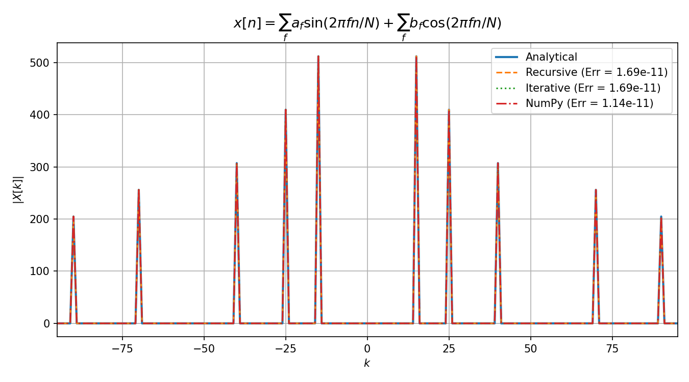
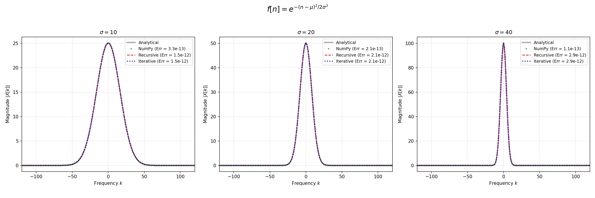
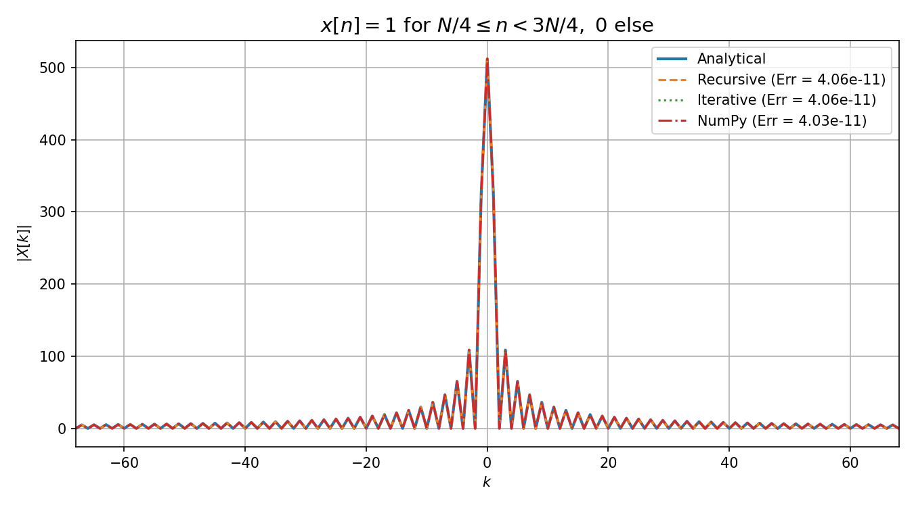
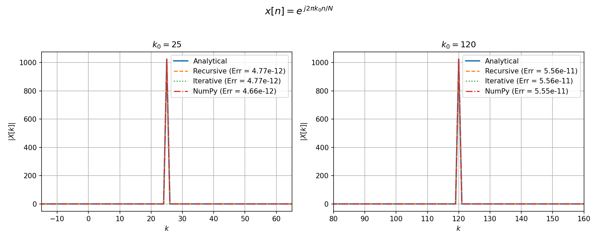
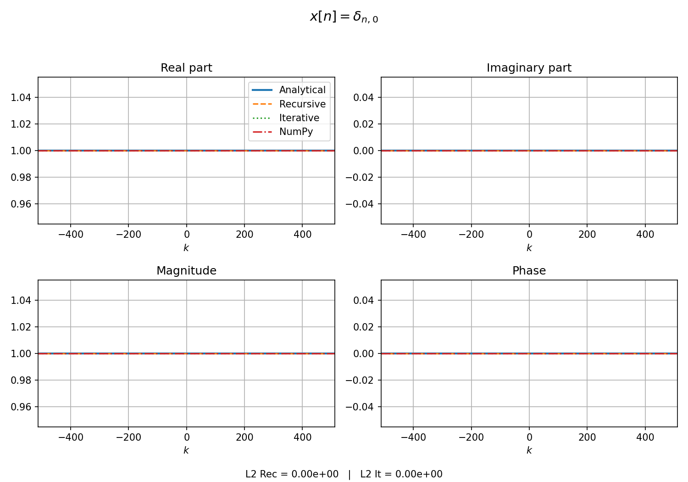
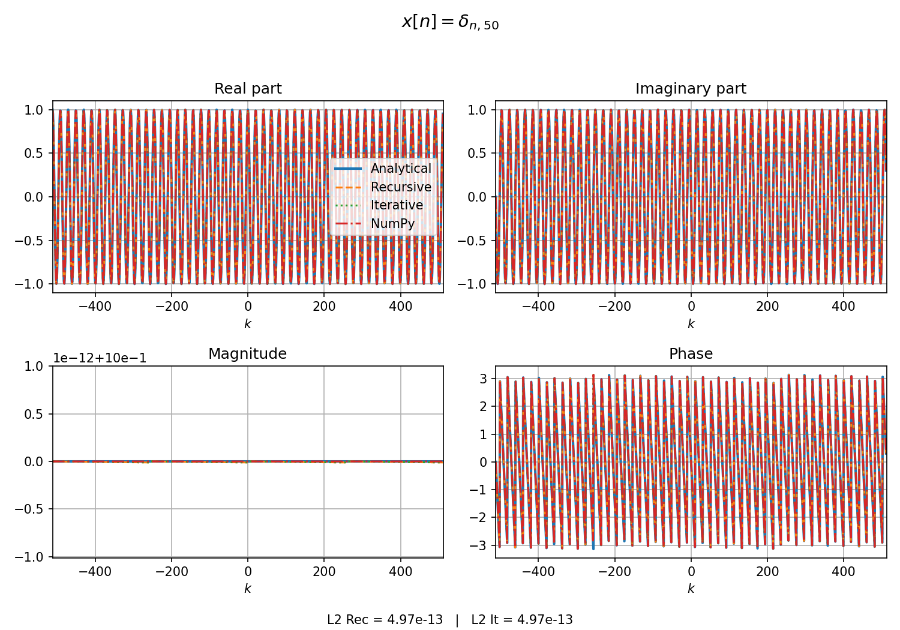
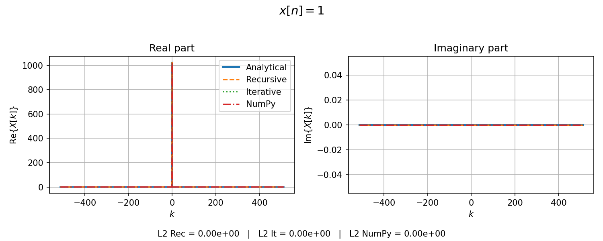
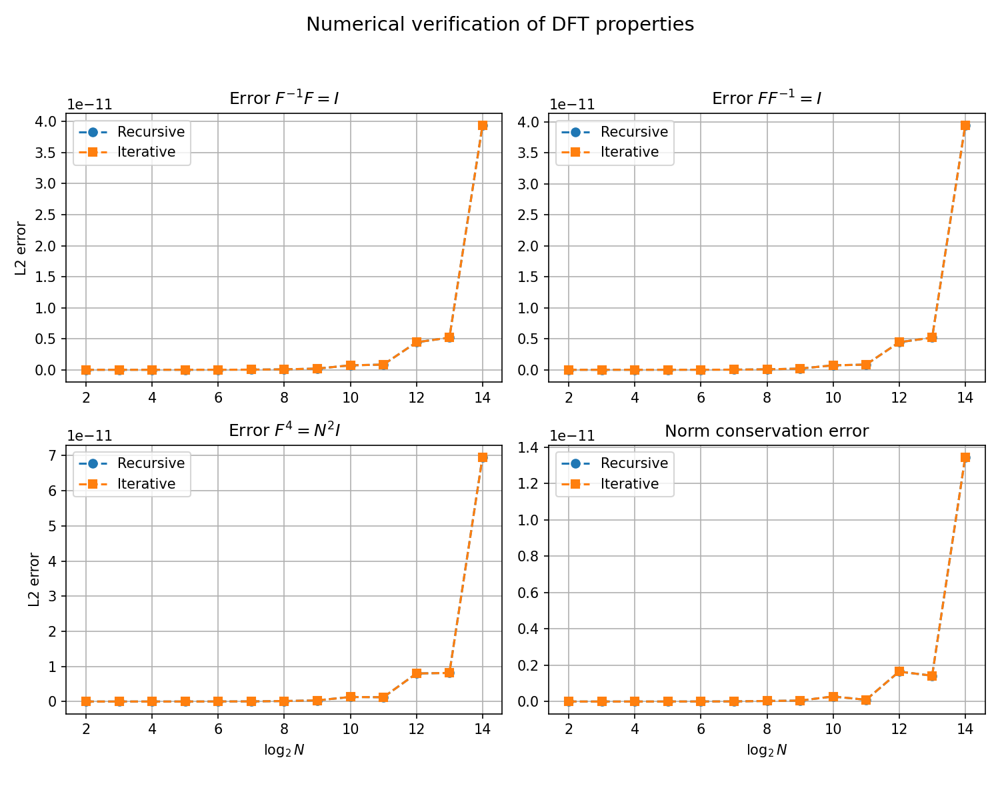
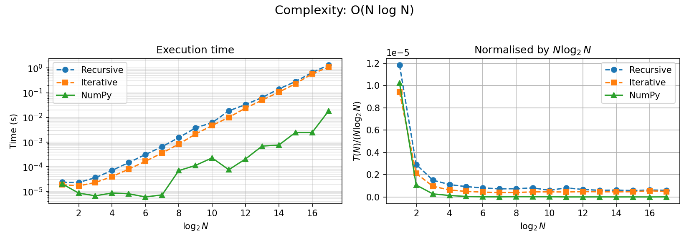
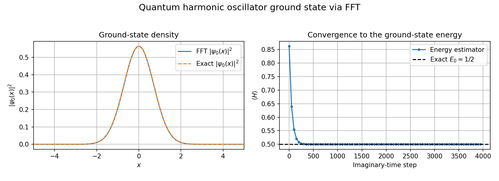

# FFT and Quantum Physics

Self-contained **recursive** and **iterative** implementations of the
Fast Fourier Transform in Python, validated against analytical
solutions and NumPy's `np.fft`, and applied to a concrete
quantum-mechanics problem — the ground state of the quantum harmonic
oscillator.

This repository is the companion code and written report for the final
project of the course *Complementos Matemáticos y Numéricos* of the
M.Sc. in Physics (Radiation, Nanotechnology, Particles and
Astrophysics) at the University of Granada.

---

## Abstract

We study the discrete Fourier transform (DFT) and its efficient
$\mathcal{O}(N\log_2 N)$ implementation through the Fast Fourier
Transform (FFT) algorithm. Two independent implementations are
provided — a recursive Cooley–Tukey split and an in-place iterative
version based on bit-reversal permutation — and their accuracy,
theoretical properties and scaling are verified numerically.
The FFT is then applied to quantum mechanics: the kinetic operator
becomes diagonal in momentum space, which enables a spectral
evaluation of the Hamiltonian. As a concrete application we compute
the ground-state energy of the 1D quantum harmonic oscillator with
an FFT-based split-operator method in imaginary time and recover
$E_0 = 1/2$ to better than $10^{-10}$.

---

## Methods

The shared module [`fft_core.py`](fft_core.py) exposes two functions
with the same interface,

```python
X = fft_rec(x, inverse=False)   # recursive Cooley–Tukey
X = fft_it (x, inverse=False)   # iterative / bit-reversal
```

Both expect a 1-D array whose length is a power of two and perform the
direct DFT for `inverse=False` and the inverse DFT for `inverse=True`.
All other scripts import these two functions so that the algorithm
lives in a single place.

Each test script targets a representative signal and compares the two
custom FFTs against NumPy's `np.fft.fft` and the closed-form DFT:

| Script                  | Signal                                            | Analytical DFT                     |
|-------------------------|---------------------------------------------------|------------------------------------|
| `test_constant.py`      | $x[n] = 1$                                        | $X[k] = N\,\delta_{k,0}$           |
| `test_deltas.py`        | $x[n] = \delta_{n,j_0}$                           | $X[k] = e^{-j 2\pi k j_0/N}$       |
| `test_sine_cosine.py`   | $\sum a_f \sin(2\pi f n/N) + \sum b_f \cos(\cdot)$| line spectrum at $\pm f$           |
| `test_gaussians.py`     | Gaussian with width $\sigma$                      | periodic-Gaussian replica sum      |
| `test_pulse.py`         | square pulse on $[N/4, 3N/4)$                     | geometric-sum closed form          |
| `test_plane_wave.py`    | $x[n] = e^{j 2\pi k_0 n/N}$                       | $X[k] = N\,\delta_{k,k_0}$         |
| `test_properties.py`    | complex Gaussian random vectors                   | $F^{-1}F=I$, $F^4=N^2 I$, Parseval |
| `test_timing.py`        | random vectors up to $N=131\,072$                 | $t(N) \propto N\log_2 N$           |

The quantum-mechanics application is implemented in
[`harmonic_oscillator.py`](harmonic_oscillator.py), which propagates a
trial wavefunction in imaginary time with a second-order
split-operator (Trotter) scheme and uses the FFT to apply the kinetic
kicks in momentum space.

---

## Results

### Particular cases

Every custom implementation tracks the analytical spectrum to
$L^2$ error $\lesssim 10^{-10}$, indistinguishable from NumPy's
`np.fft`.

| Sines and cosines | Gaussians |
|:--:|:--:|
|  |  |

| Square pulse | Plane wave |
|:--:|:--:|
|  |  |

| Kronecker delta $\delta_{n,0}$ | Kronecker delta $\delta_{n,50}$ |
|:--:|:--:|
|  |  |

| Constant signal |
|:--:|
|  |

### Theoretical properties

Averaging over 100 complex Gaussian random vectors, the identities
$F^{-1}F=I$, $F F^{-1}=I$, $F^{4}=N^{2}I$ and Parseval's norm
conservation all hold to $L^2$ error $\lesssim 10^{-11}$, with a mild
$\sqrt{N}$-like drift due to rounding.



### Complexity

Normalising the measured execution time by $N\log_2 N$ produces
essentially flat curves for both the recursive and iterative
implementations, confirming the expected $\mathcal{O}(N\log_2 N)$
scaling. NumPy's FFTPACK is ~2 orders of magnitude faster in absolute
terms, but the scaling is the same.



---

## Quantum harmonic oscillator via FFT

As a concrete quantum-mechanics example we compute the ground state
of the 1D quantum harmonic oscillator with the FFT. In natural units
($\hbar = m = \omega = 1$) the Hamiltonian is

$$
\hat H = -\frac{1}{2}\frac{d^2}{dx^2} + \frac{1}{2}x^{2},
\qquad
E_0 = \tfrac{1}{2},
\qquad
\psi_0(x) = \pi^{-1/4}\,e^{-x^{2}/2}.
$$

The kinetic operator is diagonal in momentum space, so it can be
evaluated efficiently with the FFT:

$$
\hat T \psi = \mathcal{F}^{-1}\!\left(\tfrac{1}{2}k^{2}\,\mathcal{F}\psi\right).
$$

Evolving in **imaginary time** $t \to -i\tau$ converts the unitary
propagator $e^{-i\hat H t}$ into an exponentially contracting filter
$e^{-\hat H \tau}$ that damps every excited state relative to the
ground state. A second-order Trotter split

$$
e^{-\hat H\,dt} \;\approx\;
e^{-\hat T\,dt/2}\,
e^{-\hat V\,dt}\,
e^{-\hat T\,dt/2}
$$

and a renormalisation at every step converge to $|\psi_0\rangle$ for
any initial state with non-zero overlap. The relevant lines of the
[`harmonic_oscillator.py`](harmonic_oscillator.py) script are:

```python
import numpy as np
from fft_core import fft_it

# Natural units, power-of-two grid for the FFT
N, L, dt, n_steps = 1024, 20.0, 0.01, 4000
dx = L / N
x  = np.linspace(-L / 2, L / 2 - dx, N)
k  = 2 * np.pi * np.fft.fftfreq(N, d=dx)

V         = 0.5 * x ** 2
expV      = np.exp(-V * dt)
expT_half = np.exp(-0.5 * k ** 2 * dt / 2)

# Initial (off-centre) trial wavefunction
psi = np.exp(-(x - 0.7) ** 2).astype(complex)
psi /= np.sqrt(np.sum(np.abs(psi) ** 2) * dx)

for _ in range(n_steps):
    # kinetic half-kick in momentum space
    psi = fft_it(fft_it(psi) * expT_half, inverse=True)
    # potential full-kick in position space
    psi *= expV
    # kinetic half-kick in momentum space
    psi = fft_it(fft_it(psi) * expT_half, inverse=True)
    # renormalise
    psi /= np.sqrt(np.sum(np.abs(psi) ** 2) * dx)

# Final energy estimator <psi|H|psi>
T_psi = fft_it(0.5 * k ** 2 * fft_it(psi), inverse=True)
E0    = np.real(np.sum(np.conj(psi) * T_psi) * dx) \
      + np.real(np.sum(np.conj(psi) * V * psi) * dx)

print(f"E_0 (FFT split-operator) = {E0:.10f}")
print(f"E_0 (exact)              = 0.5")
```

Running the full script yields

```
FFT split-operator ground-state energy : 0.50000000
Exact ground-state energy              : 0.5
Absolute error                         : 3.91e-11
```

and the probability density matches the analytical Gaussian ground
state to plotting accuracy:



---

## Reports

Fully worked-out reports (problem statement, derivations and
discussion of all the figures above) are provided in both languages:

| Language | File |
|----------|------|
| English  | [`MemoryEN.pdf`](MemoryEN.pdf) |
| Español  | [`MemoriaES.pdf`](MemoriaES.pdf) |

The LaTeX sources live in [`latex/`](latex).

---

## Repository structure

```
FFT-and-quantum-physics/
├── fft_core.py                  # shared recursive & iterative FFT
├── harmonic_oscillator.py       # QHO ground state via FFT + imag. time
├── test_constant.py             # DFT of x[n] = 1
├── test_deltas.py               # DFT of Kronecker deltas
├── test_gaussians.py            # DFT of Gaussian signals
├── test_plane_wave.py           # DFT of a complex plane wave
├── test_pulse.py                # DFT of a square pulse
├── test_sine_cosine.py          # DFT of sines and cosines
├── test_properties.py           # F^-1 F = I, F^4 = N^2 I, Parseval
├── test_timing.py               # O(N log N) scaling verification
├── figures/                     # PNGs produced by the scripts
├── latex/
│   ├── main_EN.tex
│   ├── main_ES.tex
│   ├── bibliography.bib
│   └── escudoUGRmonocromo.png
├── MemoryEN.pdf
└── MemoriaES.pdf
```

---

## Usage

Requires Python 3.10+, `numpy` and `matplotlib`.

```bash
# Validation against closed-form DFTs
python test_constant.py
python test_deltas.py
python test_gaussians.py
python test_pulse.py
python test_sine_cosine.py
python test_plane_wave.py

# Theoretical properties (slow: 100 runs × 13 sizes)
python test_properties.py

# O(N log N) scaling (slow: up to N = 131 072)
python test_timing.py

# Quantum harmonic oscillator
python harmonic_oscillator.py
```

Each script writes its figure to `figures/`.

---

## Author

**Ali-Salem Amari** — M.Sc. in Physics, University of Granada.
